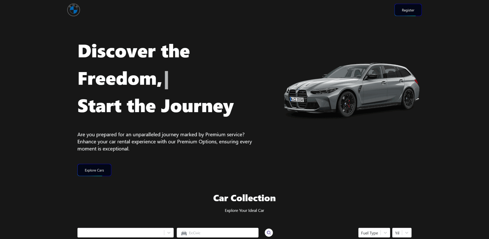

# Car Rental in React Vite

## Description

A modern car rental application built with React Vite and TypeScript. This app allows users to search for, filter, and rent cars from a variety of options. It provides a seamless user experience with dynamic content and animations.

## Features

- Search and Filter: Easily find cars by model, type, or price range.
- Interactive UI: Smooth transitions and animations enhance user engagement.
- Responsive Design: Optimized for mobile and desktop views.
- API Integration: Fetch real-time data from external APIs.
- Typewriter Effect: Dynamic text display on key sections.
- Custom Styling: Tailored appearance using Tailwind CSS.

## Libraries

- **typescript**:Adds static typing to JavaScript, improving code quality and development experience.
- **react-router-dom**:Manages in-app routing, enabling navigation between different pages.
- **react-select**:Provides a customizable select input for choosing car options.
- **tailwind**:Utility-first CSS framework for styling the application with ease.
- **framer-motion**:Adds animations and transitions to enhance the user interface.
- **typewriter-effect**:Creates a typewriter animation for displaying dynamic text content.

## Elements

- [Button](https://uiverse.io/Itskrish01/tough-frog-18)A visually appealing button element used in the application.

## API

- [Cars-API](https://rapidapi.com/apininjas/api/cars-by-api-ninjas)Fetches car data including models, prices, and details.
- [Imaginstudio-API](https://www.imaginstudio.com/?r=0)Provides high-quality car images and assets.

## Preview



## Deployment

The project is deployed and can be accessed [here](https://car-rental-h8amcpslp-quadriceps-projects.vercel.app/). For the project to run smoothly, please follow the installation steps below to set it up locally.The project may behave differently across different browsers.

## Installation

To run the project locally, follow these steps:

1. Clone the repository:

```bash
git clone https://github.com/KamilErdogmus/Car-Rental-App.git
```

2. Navigate to the project directory:

```bash
cd your-repository
```

3. Install dependencies:

```bash
npm install
```

4. Start the development server:

```bash
npm  npm run dev
```

5. Open your web browser and visit http://localhost:5173 to view the application.
